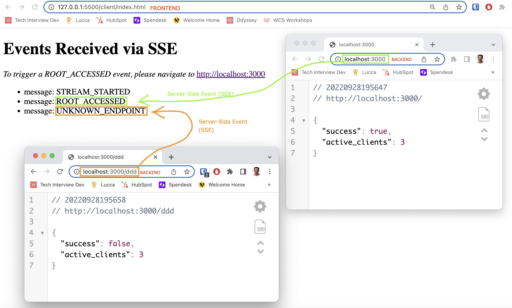

# Fastify SSE Starter

This application is incredibly simple, but also powerful.

## Backend

The backend can be launched with the following simple commands:
```
npm i
npm run dev
```

## Frontend

The frontend is simply an HTML file which can be found at `client/index.html`.

To launch the frontend. Simply open that file in the browser 😀

## And then?

Try to open multiple tabs in the browser with the same frontend, then, follow the instructions.

